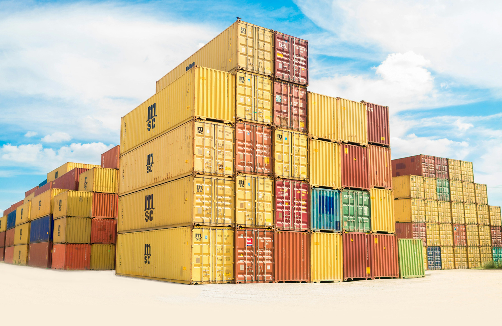

### About Sumaya Hassan

I am a Data Scientist with expertise in predictive analytics, AI, and data engineering. With Master’s degrees in Education and the Humanities, I blend technical skills with an understanding of learning and human behavior. My experience includes building data pipelines, developing machine learning models, and applying NLP and Vision AI to solve complex problems. I have worked across industry and academia as a researcher, lecturer, and academic coach, leveraging data-driven insights to improve customer retention and drive educational transformation.

### Projects by Sumaya Hassan 

- #### Sustainable Energy Transformation
  

The "Spain Electricity Shortfall Challenge" initiative examined Spain's energy production patterns, emphasizing both renewable and fossil fuel sources. Its core aim was to create a reliable machine learning model capable of forecasting energy demand shortages, offering essential insights to support renewable energy investments in Spain.

- #### Employees Absenteeism Analysis

  

The "Employee Absenteeism Analysis" initiative focused on examining patterns of employee absenteeism to improve workplace productivity and attendance. Its primary objective was to determine the main factors influencing absenteeism and offer practical recommendations for better workforce management.

- #### Movie Recommender System

  

The "Movie Recommender System" initiative aimed to create a recommendation engine that suggests movies to users based on their viewing history and preferences. Its main goal was to boost user engagement and satisfaction by providing personalized movie recommendations, enhancing the overall user experience.

- #### Supply Chain Logistics Optimization

  

The "Supply Chain Logistics Optimization" initiative focused on analyzing the intricacies of supply chain logistics through advanced SQL query writing. Its goal was to generate valuable insights that drive data-informed strategies for improving supply chain efficiency and decision-making. The project's primary aim was to streamline operations, adapt to market dynamics, minimize costs, and enhance customer satisfaction.

- #### Climate Change Sentiment Classification 

  

The "Climate Change Sentiment Classification" initiative aimed to develop a machine learning model that categorizes individuals' beliefs about climate change based on their tweets. This model provided businesses with valuable insights into public perceptions, enabling them to align their marketing strategies with their target audience's values and beliefs.

### Contact

- *Email:* [sumayahassan1@gmail.com](mailto:sumayahassan1@gmail.com)
- *LinkedIn:* [Connect with me](https://www.linkedin.com/in/sumayah-hassan/)
- *URL:* [My Portfolio](https://sumayahassan.github.io)

### Skills
- *Technical Skills*
  - Data Preprocessing
  - Data Analysis
  - Data Visualization
  - Anomalies Detection
  - Machine Learning
  - Python
  - Spark
  - SQL Query Writing
  - Power BI
  - AWS Cloud Computing
  - Streamlit App Creation and Deployment
    
- *Soft Skills*
  - Team Leadership
  - Team Management
  - Project Management
  - Project Analysis
  - Teamwork
  - Communication
  - Emotional Intelligence
  - Critical Thinking
  - Problem Solving
  - Curiosity
  - Taking Initiative
  - Cultural Awareness

I'm passionate about using data and AI to make a difference. Let's connect and explore the endless possibilities of data science together!
